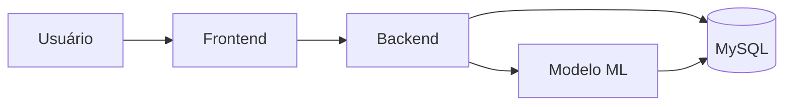

# Pryzor - Previsão de Descontos na Steam

> **TCC - Engenharia de Software**  
> Sistema inteligente que prevê quando jogos da Steam vão entrar em promoção

Sabe quando você fica na dúvida se compra um jogo agora ou espera uma promoção? O Pryzor resolve isso. Ele analisa o histórico de preços da Steam e usa Machine Learning para prever se vale a pena esperar por um desconto melhor.

---

## O Problema

Todo gamer já passou por isso:
- Comprou um jogo e ele entrou em promoção na semana seguinte
- Ficou esperando um desconto que nunca chegou
- Não sabe se o preço atual é bom ou se vale esperar

O Pryzor foi criado para acabar com essas dúvidas.

---

## 💡 A Solução

O sistema funciona assim:

1. **Você busca o jogo** que quer comprar
2. **O Pryzor analisa** o histórico de preços e padrões de desconto
3. **O modelo de ML prevê** se vai ter promoção nos próximos 30 dias
4. **Você recebe uma recomendação clara**: "Compre agora" ou "Vale esperar"

Simples, direto e útil.

---


## Arquitetura do Sistema

O Pryzor segue arquitetura client-server, separando frontend (React + TypeScript) e backend (FastAPI + Python).

### Componentes Principais
- Frontend: Interface web para busca, análise e recomendação
- Backend: API REST, serviço de predição ML, integração MySQL
- Banco de dados: MySQL, persistência de jogos e histórico de preços
- Serviço ML: Random Forest, pipeline de ETL e validação temporal

### Diagrama C4 (nível de containers)



### Schema do Banco de Dados

**Tabela `games`:**
- `appid` (INT, PK): ID único do jogo na Steam
- `name` (VARCHAR): Nome do jogo
- `type` (VARCHAR): Tipo (game, dlc, etc.)
- `releasedate` (DATE): Data de lançamento
- `freetoplay` (TINYINT): Se é gratuito (0/1)

# Pryzor - Previsão de Descontos na Steam

> **TCC - Engenharia de Software**  
> Sistema inteligente que recomenda se vale esperar uma promoção

## 1. Visão Geral
O Pryzor analisa histórico de preços da Steam e prevê se um jogo terá desconto ≥20% nos próximos 30 dias. Resultado: recomendação objetiva (comprar agora ou esperar). Foco em alta precisão para evitar falsos alarmes e aumentar confiança do usuário.

## 2. Arquitetura
Arquitetura client-server: frontend (React + TypeScript) e backend (FastAPI + Python + MySQL + modelo Random Forest). Modelo carregado lazy na API.


Banco (simplificado): `games(appid PK, name, releasedate, freetoplay)` e `price_history(id PK, appid FK, date, final_price, initial_price, discount)`.

## 3. Funcionalidades & Casos de Uso
- Busca e listagem de jogos
- Histórico de preços e estado atual
- Previsão individual e em lote (≥20% em 30 dias)
- Recomendação de compra ou espera
- Estatísticas gerais do sistema
- Setup/importação inicial de dados

## 4. Quick Start
Backend:
```bash
cd pryzor-back
python -m venv venv
venv\Scripts\activate  # Windows
pip install -r requirements.txt
# criar .env (base em .env.example)
python src/main.py
```
Docs: http://localhost:8000/docs

Frontend:
```bash
cd pryzor-front
npm install
npm run dev
```
Interface: http://localhost:5173

## 5. Principais Endpoints
Sistema: `GET /health`, `GET /api/stats`
Jogos: `GET /api/games`, `GET /api/games/{appid}`, filtro `?search=`
ML: `GET /api/ml/info`, `GET /api/ml/predict/{appid}`, `POST /api/ml/predict/batch`

Exemplo:
```json
{
  "appid": 271590,
  "will_have_discount": true,
  "probability": 0.78,
  "recommendation": "AGUARDAR",
  "current_price": 119.90
}
```

## 6. Modelo de ML (Resumo)
Objetivo: prever se haverá desconto ≥20% em 30 dias. 
Features (8): month, quarter, final_price, discount_percent, is_summer_sale, is_winter_sale, day_of_week, is_weekend.
Validação temporal (cut 2020-04-01). Métricas (teste): Precision 90.46%, F1 74.34%, Recall 63.09%, ROC-AUC 79.45%. Alta precision → poucas recomendações erradas de “esperar”. Random Forest escolhido por melhor equilíbrio entre desempenho, interpretabilidade e tempo de treino.

Mais detalhes (pipeline completo, histórico de versões v2.0 / v3.0 / v2.1, comparação de algoritmos, lições aprendidas): ver `docs/model_evolution.md`.

## 7. Desenvolvimento & Testes
Abordagem incremental orientada a testes. Cobertura crítica (backend ~33%, frontend ~58%) garantindo refatoração segura.
Backend:
```bash
cd pryzor-back
pytest --cov=src
```
Frontend:
```bash
cd pryzor-front
npm test -- --coverage
```
Relatórios locais em `reports/`. CI executa testes em cada push. Não foi TDD estrito em todas as features, mas princípios de validação contínua foram seguidos.

## 8. CI/CD & Deploy
GitHub Actions: testes + cobertura + deploy automático (Render) na branch `main` para cada repositório (backend e frontend). Ao passar nos testes, serviço é atualizado sem intervenção manual.

## 9. Estrutura do Repositório
```
pryzor/
├── pryzor-back/       # API + ML
│   ├── src/           # Código da API
│   ├── scripts/       # Treino / utilidades
│   ├── ml_model/      # Modelo (.pkl)
│   ├── tests/         # Testes pytest
│   └── docs/          # Doc técnica específica
├── pryzor-front/      # Interface React
│   └── src/           # Componentes e serviços
├── docs/              # Documentação aprofundada (ML evolução)
├── CONTEXT.md
├── COPILOT_PROMPT.md
└── README.md
```

## 10. Contexto Acadêmico
Projeto de TCC demonstrando aplicação real de ML com validação temporal correta, engenharia de software limpa, testes automatizados e documentação reprodutível. Ênfase em confiabilidade de recomendação (precision alta) e transparência metodológica.

## 11. Licença & Ética
Uso acadêmico. Dados públicos/sintéticos, sem informações pessoais. Conformidade com princípios de privacidade (LGPD). Evolução futura: revisão contínua de políticas.

## 12. Autor
Gustavo Peruci — GitHub: https://github.com/GustaPeruci  
TCC Engenharia de Software - 2025

## 13. Links Úteis
- Repositório principal: https://github.com/GustaPeruci/Pryzor
- Frontend: https://github.com/GustaPeruci/pryzor-front
- Backend: https://github.com/GustaPeruci/pryzor-back
- Deploy (frontend): https://pryzor-front.onrender.com/
- API Docs: http://localhost:8000/docs
- Vídeo pitch: ./Apresentação%20pitch%20Pryzor.mp4

---
Para histórico detalhado do modelo e experimentos rejeitados acesse `docs/model_evolution.md`.