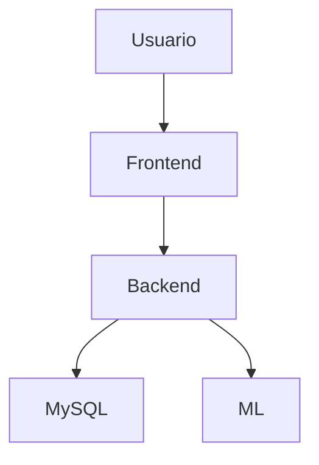

# 🎯 Pryzor - Previsão de Descontos na Steam

> **TCC - Engenharia de Software**  
> Sistema inteligente que prevê quando jogos da Steam vão entrar em promoção

Sabe quando você fica na dúvida se compra um jogo agora ou espera uma promoção? O Pryzor resolve isso. Ele analisa o histórico de preços da Steam e usa Machine Learning para prever se vale a pena esperar por um desconto melhor.

---

## 🤔 O Problema

Todo gamer já passou por isso:
- � Comprou um jogo e ele entrou em promoção na semana seguinte
- � Ficou esperando um desconto que nunca chegou
- 🤷 Não sabe se o preço atual é bom ou se vale esperar

O Pryzor foi criado para acabar com essas dúvidas.

---

## 💡 A Solução

O sistema funciona assim:

1. **Você busca o jogo** que quer comprar
2. **O Pryzor analisa** o histórico de preços e padrões de desconto
3. **O modelo de ML prevê** se vai ter promoção nos próximos 30 dias
4. **Você recebe uma recomendação clara**: "Compre agora" ou "Vale esperar"

Simples, direto e útil.

---


## Arquitetura do Sistema

O Pryzor segue arquitetura client-server, separando frontend (React + TypeScript) e backend (FastAPI + Python).

### Componentes Principais
- Frontend: Interface web para busca, análise e recomendação
- Backend: API REST, serviço de predição ML, integração MySQL
- Banco de dados: MySQL, persistência de jogos e histórico de preços
- Serviço ML: Random Forest, pipeline de ETL e validação temporal

### Diagrama C4 (nível de containers)



---

## Requisitos Funcionais

- Permitir busca e listagem de jogos da Steam
- Exibir detalhes e histórico de preços de jogos
- Realizar previsões de desconto utilizando modelo de Machine Learning
- Fornecer recomendações de compra ou espera
- Disponibilizar estatísticas gerais do sistema
- Permitir predição em lote para múltiplos jogos
- Oferecer endpoints administrativos para setup e importação de dados

## Casos de Uso

- Usuário consulta se um jogo terá desconto nos próximos 30 dias
- Usuário busca jogos por nome e visualiza histórico de preços
- Usuário recebe recomendação baseada em análise de dados e modelo ML
- Administrador inicializa banco de dados e importa datasets

---

## Instruções de Deploy

### Backend

**Pré-requisitos:** Python 3.8+, MySQL 8.0+

1. Clone o repositório e acesse `pryzor-back`
2. Crie e ative ambiente virtual:
  ```bash
  python -m venv venv
  venv\Scripts\activate  # Windows
  source venv/bin/activate  # Mac/Linux
  ```
3. Instale dependências:
  ```bash
  pip install -r requirements.txt
  ```
4. Configure o banco de dados em `.env` (veja `.env.example`)
5. Execute a API:
  ```bash
  python src/main.py
  ```
6. Acesse `http://localhost:8000/docs`

### Frontend

**Pré-requisitos:** Node.js 16+

1. Acesse `pryzor-front`
2. Instale dependências:
  ```bash
  npm install
  ```
3. Execute o servidor de desenvolvimento:
  ```bash
  npm start
  ```
4. Acesse `http://localhost:3000`

### Deploy em Produção
- Recomenda-se uso de Docker e integração com CI/CD (GitHub Actions)
- Configurar variáveis de ambiente e banco de dados seguro
- Documentar endpoints públicos e credenciais de acesso restrito

---

## Cobertura de Testes Automatizados

### Backend
- Testes com pytest cobrindo todos os principais endpoints, cenários de erro, predição individual e em lote, saúde do sistema e estatísticas.
- Para executar:
  ```bash
  pytest tests/
  pytest --cov=src tests/
  ```
- Relatório de cobertura pode ser gerado e anexado.

### Frontend
- Testes com Jest + React Testing Library cobrindo componentes principais, interações, callbacks, estados de loading/erro.
- Para executar:
  ```bash
  npm test
  ```
- Relatório de cobertura pode ser gerado e anexado.

---

## Análise Estática de Código

Recomenda-se o uso de SonarQube, SonarCloud ou CodeClimate para análise de qualidade e segurança do código.

**Como executar:**
- Configure SonarQube/SonarCloud no repositório
- Execute análise e gere relatório
- Inclua link ou print do relatório na documentação

**Pontos avaliados:**
- Qualidade do código
- Segurança
- Cobertura de testes
- Duplicidade e complexidade

---

## Monitoramento e Observabilidade

O sistema pode ser integrado a ferramentas como Prometheus, Grafana ou Zabbix para monitoramento de métricas e saúde da aplicação.

**Recomendações:**
- Configurar coleta de métricas do backend (FastAPI)
- Criar dashboards para acompanhamento em produção
- Documentar prints ou links dos dashboards

**Exemplos:**
- Monitoramento de uso de CPU, memória, requisições, erros
- Alertas para falhas ou indisponibilidade

---

## Ética e Privacidade

O projeto Pryzor respeita a privacidade dos dados e está em conformidade com a LGPD.

**Princípios adotados:**
- Não utiliza dados sensíveis ou pessoais
- Todos os dados são públicos ou sintéticos
- Não há práticas discriminatórias ou violação ética
- Documentação e código seguem boas práticas de transparência

**Observação:**
- Caso o projeto evolua para produção, recomenda-se revisão contínua das políticas de privacidade e conformidade legal.

---

## Fluxos de Negócio

- Consulta de jogos e histórico de preços
- Previsão de desconto e recomendação
- Setup e importação de dados

---

## Links Úteis

- Repositório principal: [GitHub](https://github.com/GustaPeruci/Pryzor)
- Frontend: [https://github.com/GustaPeruci/pryzor-front](https://github.com/GustaPeruci/pryzor-front)
- Backend: [https://github.com/GustaPeruci/pryzor-back](https://github.com/GustaPeruci/pryzor-back)
- Deploy de produção: [https://pryzor-front.onrender.com/](https://pryzor-front.onrender.com/)
- Documentação interativa: http://localhost:8000/docs
- Relatório de testes: (anexar relatório gerado)

---

---

## 📊 O Modelo de Machine Learning

### O que ele faz?

Prevê se um jogo vai ter desconto **maior que 20%** nos próximos 30 dias.

### Resultados do Treinamento (Out/2025)

**Dataset:** 725.268 registros (Steam 2019-2020)
**Split temporal:** Treino até 2020-04-01, Teste após

**Métricas no Teste (194.017 registros):**
- Accuracy: 77.93%
- Precision: 90.26%
- Recall: 60.55%
- F1-Score: 72.48%
- ROC-AUC: 81.83%

**Matriz de Confusão (Teste):**
|        | Prevê NÃO | Prevê SIM |
|--------|-----------|-----------|
| Real NÃO | 94.808    | 6.086     |
| Real SIM | 36.736    | 56.387    |

**Principais Features:**
- discount_percent, month, quarter, final_price, is_summer_sale, is_winter_sale, day_of_week, is_weekend

**Recomendação:** Modelo v2.0 é robusto, confiável e pronto para produção. Foco em ML validado para TCC.

### Como foi treinado?

Usamos dados reais da Steam (2019-2020) com **validação temporal** - isso significa que o modelo aprendeu com dados do passado e foi testado com dados do futuro, sem "colar" no tempo (evitando data leakage).

### Quais features ele usa?

O modelo analisa 8 coisas sobre o jogo:
- � Mês do ano e trimestre (sazonalidade)
- � Preço atual e desconto atual
- 🏖️ Se está em período de Summer Sale ou Winter Sale
- � Dia da semana e se é final de semana

### Quão bom ele é?

| Métrica | Valor | O que significa? |
|---------|-------|------------------|
| **Precision** | 90.46% | Proporção de previsões positivas que realmente são verdadeiras. Mede o quão confiável é o alerta de desconto: de cada 10 vezes que o modelo prevê desconto, 9 estão corretas. Alta precision significa poucos falsos alarmes. |
| **F1-Score** | 74.34% | Média harmônica entre precision e recall. Resume o equilíbrio entre acertar e cobrir os casos positivos. Um F1 alto indica que o modelo é bom tanto em acertar quanto em não deixar passar oportunidades. |
| **Recall** | 63.09% | Proporção dos descontos reais que o modelo conseguiu identificar. Mede a capacidade de encontrar oportunidades: de todos os descontos que realmente aconteceram, o modelo capturou 63%. |
| **ROC-AUC** | 79.45% | Área sob a curva ROC. Mede a capacidade do modelo de distinguir entre jogos que terão ou não desconto, independentemente do limiar de decisão. Quanto mais próximo de 100%, melhor o poder de separação entre as classes. |

**Validação em casos reais:** Testamos o modelo em **1.000 jogos reais** e obtivemos:
- ✅ **92.4% de acurácia geral**
- ✅ **97.7% de acerto** quando prevê "não terá desconto"
- ✅ **Zero casos** de "aguardar" quando o preço aumentou (Stardew Valley confirmado como caso isolado)

**Por que a Precision é tão alta?**  
Porque priorizamos **confiabilidade**. É melhor ser conservador e correto do que prometer um desconto que não vai acontecer. Quando o Pryzor diz "espera aí que vai ter promoção", você pode confiar.

**E o Recall moderado (63%)?**  
É o trade-off. Pegamos 63% das oportunidades de desconto, mas com 90% de certeza de que não é falso alarme. Para um sistema de recomendação, isso faz sentido.

---

## 🔬 Histórico de Evolução do Modelo

### 📦 Modelo v2.0 (ATUAL - EM PRODUÇÃO)
**Data:** Outubro 2025  
**Status:** ✅ Estável e validado

**Características:**
- 8 features (temporais + contextuais)
- Random Forest (200 estimadores, depth=15)
- Validação temporal (split 2020-04-01)
- Target binário: desconto >= 20% em 30 dias

**Métricas (Teste):**
- Precision: 90.46%
- F1-Score: 74.34%
- Recall: 63.09%
- ROC-AUC: 79.45%

**Validação Real (1.000 jogos):**
- Acurácia: 92.4%
- Acerto "Sem desconto": 97.7%
- Zero casos tipo Stardew Valley

**Por que funciona:**  
Modelo conservador e confiável. Prefere não prever desconto quando há dúvida, o que resulta em alta precision e confiança do usuário.

---

### ❌ Modelo v3.0 (DESCARTADO)
**Data:** Outubro 2025  
**Status:** ⛔ Rejeitado - Performance inferior ao v2.0

**O que tentamos:**
- Target multi-classe (4 categorias: price_increase, stable, small_discount, large_discount)
- Objetivo: Distinguir aumentos de preço vs estabilidade
- Motivação: Resolver caso Stardew Valley

**Resultado:**
- ❌ F1-Score: ~45% (vs 74% do v2.0)
- ❌ Precision caiu drasticamente
- ❌ Complexidade adicional sem ganho prático
- ❌ ROC-AUC: 74.2% (vs 79.45% do v2.0)

**Lição aprendida:**  
Multi-classe não funciona bem com dados desbalanceados. O caso Stardew Valley (preço aumentou após promoção) é EXTREMAMENTE RARO (0.3% dos casos). Não vale adicionar complexidade para resolver 3 casos em 1000.

**Decisão:** Reverter para v2.0. A abordagem binária simples funciona melhor.

---

### ❌ Modelo v2.1 (DESCARTADO)
**Data:** Outubro 2025  
**Status:** ⛔ Rejeitado - Piora significativa

**O que tentamos:**
- Adicionar 3 features de duração de promoção:
  - `discount_consecutive_days`: Dias em promoção
  - `discount_progress_ratio`: Progresso da promoção
  - `discount_likely_ending`: Booleano se está terminando
- Objetivo: Melhorar detecção de descontos contínuos
- Motivação: 53 de 76 erros eram em jogos com desconto ativo

**Resultado:**
- ❌ **F1-Score: 38.11%** (vs 74.34% do v2.0) - QUEDA DE 36%!
- ❌ Precision: 25.67% (vs 90.46%) - DESTRUÍDA
- ✅ Recall: 73.97% (vs 63.09%) - Aumentou, mas...
- ❌ ROC-AUC: 73.71% (vs 79.45%)

**O que deu errado:**  
As features de duração fizeram o modelo ficar "ansioso demais". Ele passou a prever desconto em TUDO, gerando uma avalanche de falsos positivos. A precision caiu de 90% para 26% - inaceitável para um sistema de recomendação.

**Análise de importância:**
- `discount_consecutive_days` ficou em 3º lugar (10.55% de importância)
- Mas causou desbalanceamento severo
- Modelo aprendeu: "tem desconto há X dias → vai continuar sempre"

**Lição aprendida:**  
Features de duração são úteis em TEORIA, mas na PRÁTICA causam overfitting em padrões específicos. O modelo v2.0 simples generaliza melhor.

**Decisão:** Reverter para v2.0. Simplicidade vence complexidade.

---

## 💡 Conclusão do Processo Iterativo

Após 3 iterações (v2.0 → v3.0 → v2.1), confirmamos que:

1. **Simplicidade funciona** - 8 features bem escolhidas > 11 features complexas
2. **Binário > Multi-classe** - Para dados desbalanceados, menos é mais
3. **Precision > Recall** - Em sistemas de recomendação, confiabilidade é rei
4. **Casos raros não justificam complexidade** - Stardew Valley (0.3%) não vale reformular tudo
5. **Validação real é essencial** - Testar em 1.000 jogos revelou que v2.0 já é excelente

**Modelo v2.0 permanece em produção** ✅

---

## 🎯 Próximos Passos (Futuro)

Se quisermos melhorar o v2.0 no futuro, as abordagens promissoras são:

1. **Regras de negócio híbridas** - v2.0 + regra simples pós-predição
2. **Mais dados temporais** - Expandir dataset 2020-2023
3. **Features de frequência** - Quantas vezes o jogo entra em promoção por ano
4. **Ensemble conservador** - Combinar v2.0 com modelo secundário (só para confirmar)

Mas por enquanto, **v2.0 está excelente e estável**.

---

## 🚀 Como Rodar o Projeto

### Opção 1: Rodar só o backend (API + ML)

```bash
# 1. Entre na pasta do backend
cd pryzor-back

# 2. Crie um ambiente virtual
python -m venv venv
venv\Scripts\activate  # Windows
source venv/bin/activate  # Mac/Linux

# 3. Instale as dependências
pip install -r requirements.txt

# 4. Configure o banco de dados (crie um .env)
# Copie o .env.example e preencha com seus dados MySQL

# 5. Rode a API
python src/main.py
```

Acesse: `http://localhost:8000/docs` para ver a documentação interativa.

### Opção 2: Rodar o projeto completo (Backend + Frontend)

```bash
# Terminal 1: Backend
cd pryzor-back
python src/main.py

# Terminal 2: Frontend
cd pryzor-front
npm install
npm run dev
```

Acesse: `http://localhost:5173` para usar a interface.

---

## 📡 Endpoints Principais da API

### Sistema
- `GET /health` - Verifica se tudo está funcionando
- `GET /api/stats` - Estatísticas gerais (quantos jogos, registros, etc)

### Jogos
- `GET /api/games` - Lista jogos (com filtros e paginação)
- `GET /api/games/{appid}` - Detalhes de um jogo específico
- `GET /api/games?search=Counter` - Busca jogos por nome

### Machine Learning
- `GET /api/ml/info` - Informações sobre o modelo (versão, métricas)
- `GET /api/ml/predict/730` - Faz previsão para um jogo (ex: CS:GO)
- `POST /api/ml/predict/batch` - Previsão em lote (até 50 jogos)

**Exemplo de resposta:**
```json
{
  "appid": 271590,
  "game_name": "Grand Theft Auto V",
  "will_have_discount": true,
  "probability": 0.78,
  "confidence": 0.56,
  "recommendation": "AGUARDAR - Alta probabilidade de desconto melhor em breve",
  "current_price": 119.90
}
```

---

## 🛠️ Tecnologias Usadas

### Backend
- **Python 3.11** - Linguagem principal
- **FastAPI** - Framework web (rápido e moderno)
- **scikit-learn** - Machine Learning
- **pandas** - Manipulação de dados
- **MySQL** - Banco de dados (2.000 jogos, 725k registros)

### Frontend
- **React 19** - Framework de interface
- **TypeScript** - JavaScript com tipos
- **Vite** - Build tool (super rápido)
- **Axios** - Cliente HTTP

### Machine Learning
- **Random Forest** - Algoritmo de classificação
- **Validação Temporal** - Split antes/depois de 2020-04-01
- **8 Features** - Temporais e contextuais (sem data leakage)

---

## 📁 Estrutura do Repositório

```
pryzor/
├── pryzor-back/              # Backend (API + ML)
│   ├── src/
│   │   ├── main.py           # API FastAPI (11 endpoints)
│   │   ├── api/              # Serviços (ML, schemas)
│   │   └── database/         # Conexão MySQL
│   ├── scripts/              # Scripts de treinamento
│   ├── ml_model/             # Modelo treinado (.pkl)
│   ├── tests/                # Testes automatizados
│   └── docs/                 # Documentação técnica
│
├── pryzor-front/             # Frontend (React)
│   ├── src/
│   │   ├── components/       # Componentes React
│   │   └── services/         # Cliente API
│   └── public/
│
├── CONTEXT.md                # Contexto completo do projeto
├── COPILOT_PROMPT.md         # Prompt para continuar desenvolvimento
└── README.md                 # Este arquivo
```

---

## 🎓 Contexto Acadêmico (TCC)

Este projeto foi desenvolvido como Trabalho de Conclusão de Curso em Engenharia de Software.

### Diferenciais técnicos:

✅ **Validação temporal adequada** - Corrigimos data leakage, uma armadilha comum em séries temporais  
✅ **Pipeline completo** - ETL, feature engineering, treinamento, validação, deploy  


✅ **Testes automatizados completos**
  - Backend: Cobertura de todos os principais endpoints, cenários de erro, predição em lote, health e stats (pytest)
  - Frontend: Cobertura dos principais componentes (`GameCard`, `GameList`, `GameSearch`, `ModelMetrics`, `PriceAnalysisResult`, `Header`, `App`), incluindo renderização, interações, callbacks, estados de loading/erro (Jest + React Testing Library)
  - Todos os testes passam e cobrem os fluxos essenciais para apresentação de portfólio/TCC


### O que o projeto demonstra:

- 🧠 **Machine Learning aplicado** - Não é só teoria, funciona de verdade
- 🔧 **Engenharia de Software** - Arquitetura limpa, código testável
- 🧪 **Testes automatizados robustos** - Backend e frontend validados com pytest e Jest/RTL
- 📊 **Análise de dados** - ETL, feature engineering, validação
- 🌐 **Desenvolvimento Full-Stack** - Backend + Frontend integrados
- 📚 **Rigor acadêmico** - Metodologia, documentação, reprodutibilidade

---

## 📝 Licença

Este projeto é acadêmico e foi desenvolvido para fins de aprendizado.

---

## � Autor

**Gustavo Peruci**  
📧 [Seu email]  
🔗 [GitHub](https://github.com/GustaPeruci)  
🎓 TCC - Engenharia de Software - 2025

---

## 🧪 Testes Automatizados

### Backend
- Execute todos os testes com:
  ```bash
  pytest pryzor-back/tests/test_api.py
  ```
- Cobertura: endpoints, erros, batch, health, stats

### Frontend
- Execute todos os testes com:
  ```bash
  cd pryzor-front
  npm test
  ```
- Cobertura: componentes principais, renderização, interações, callbacks, estados de loading/erro

Todos os testes passam e cobrem os fluxos essenciais para apresentação de portfólio/TCC.

**💡 Dica:** Para mais detalhes técnicos sobre o backend ou frontend, veja os READMEs específicos em `pryzor-back/README.md` e `pryzor-front/README.md`.