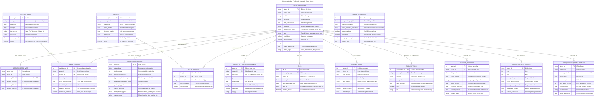

```mermaid
---
title: Sistema de Análise Preditiva de Preços de Jogos Steam
---
erDiagram
    %% ============== TABELA PRINCIPAL ATUAL ==============
    JOGOS_PRECOS_WIDE {
        string nome_jogo PK "Nome do jogo"
        string steam_id FK "ID do Steam"
        float semana_2014-47 "Preço na semana 47 de 2014"
        float semana_2014-48 "Preço na semana 48 de 2014"
        float semana_2014-49 "... (continua até semana atual)"
        float semana_2025-34 "Preço na semana 34 de 2025"
    }

    %% ============== NOVAS TABELAS PROPOSTAS ==============
    
    %% Tabela de Metadados dos Jogos
    JOGOS_METADADOS {
        string steam_id PK "ID único do Steam"
        string nome_jogo "Nome oficial do jogo"
        string publisher "Editora do jogo"
        string developer "Desenvolvedora"
        date data_lancamento "Data de lançamento"
        string generos "Gêneros separados por vírgula"
        string classificacao_etaria "Classificação (Everyone, Teen, etc)"
        string tags "Tags do Steam separadas por vírgula"
        boolean multiplayer "Suporte a multiplayer"
        boolean dlc_disponivel "Possui DLCs"
        string idiomas "Idiomas suportados"
        float preco_lancamento "Preço original de lançamento"
        string status_jogo "Active, Discontinued, Early Access"
    }

    %% Tabela de Popularidade e Reviews
    JOGOS_POPULARIDADE {
        string steam_id PK, FK "ID do Steam"
        date data_coleta "Data da coleta dos dados"
        int total_reviews "Número total de avaliações"
        float porcentagem_positiva "% de reviews positivas"
        int jogadores_simultaneos_pico "Pico de jogadores simultâneos"
        int jogadores_simultaneos_atual "Jogadores atuais"
        int posicao_top_sellers "Posição no ranking de vendas"
        int numero_wishlists "Número estimado de wishlists"
        float media_horas_jogadas "Média de horas jogadas pelos usuários"
        string review_score "Mostly Positive, Very Positive, etc"
    }

    %% Tabela de Eventos e Promoções Steam
    EVENTOS_STEAM {
        int evento_id PK "ID único do evento"
        string nome_evento "Nome do evento (Summer Sale, etc)"
        date data_inicio "Data de início do evento"
        date data_fim "Data de fim do evento"
        string tipo_evento "Sale, Free Weekend, Update, etc"
        string descricao "Descrição do evento"
        float desconto_medio "Desconto médio durante o evento"
        boolean global "Se afeta todos os jogos ou específicos"
    }

    %% Tabela de Participação em Eventos
    JOGOS_EVENTOS {
        int participacao_id PK "ID único da participação"
        string steam_id FK "ID do Steam do jogo"
        int evento_id FK "ID do evento Steam"
        float desconto_aplicado "% de desconto durante o evento"
        float preco_com_desconto "Preço final com desconto"
        date data_inicio_desconto "Início do desconto para este jogo"
        date data_fim_desconto "Fim do desconto para este jogo"
        boolean promocao_destaque "Se foi jogo em destaque"
    }

    %% Tabela de Preços em Outras Plataformas
    PRECOS_MULTIPLAS_PLATAFORMAS {
        int preco_id PK "ID único do preço"
        string steam_id FK "ID do Steam do jogo"
        string plataforma "Epic, GOG, Microsoft Store, etc"
        float preco "Preço na plataforma"
        date data_coleta "Data da coleta"
        string moeda "Moeda (BRL, USD, etc)"
        boolean disponivel "Se está disponível na plataforma"
        string url_loja "URL da página na loja"
    }

    %% Tabela de Bundles e Pacotes
    BUNDLES {
        int bundle_id PK "ID único do bundle"
        string nome_bundle "Nome do pacote/bundle"
        string plataforma "Steam, Humble Bundle, etc"
        float preco_bundle "Preço do bundle completo"
        float desconto_bundle "% de desconto do bundle"
        date data_inicio "Início da disponibilidade"
        date data_fim "Fim da disponibilidade"
        boolean ativo "Se ainda está disponível"
    }

    %% Tabela de Jogos em Bundles
    JOGOS_BUNDLES {
        int item_id PK "ID único do item"
        int bundle_id FK "ID do bundle"
        string steam_id FK "ID do Steam do jogo"
        float preco_individual "Preço individual do jogo"
        boolean jogo_principal "Se é o jogo principal do bundle"
    }

    %% Tabela de DLCs e Expansões
    DLCS {
        string dlc_id PK "ID único do DLC"
        string steam_id_jogo_base FK "ID do jogo base"
        string nome_dlc "Nome do DLC/Expansão"
        float preco_dlc "Preço do DLC"
        date data_lancamento_dlc "Data de lançamento do DLC"
        string tipo_dlc "Expansion, Cosmetic, Season Pass, etc"
        boolean incluido_deluxe "Se vem na edição deluxe"
    }

    %% Tabela de Dados Econômicos
    DADOS_ECONOMICOS {
        date data PK "Data do registro"
        float taxa_cambio_usd_brl "Taxa USD para BRL"
        float inflacao_mensal_br "Inflação mensal Brasil"
        float indice_confianca_consumidor "Índice de confiança do consumidor"
        boolean feriado_nacional "Se é feriado nacional"
        boolean black_friday "Se é período de Black Friday"
        boolean mes_pagamento_13 "Se é mês de 13º salário"
        int semana_mes "Semana do mês (1-4)"
    }

    %% Tabela de Updates e Patches
    UPDATES_JOGOS {
        int update_id PK "ID único do update"
        string steam_id FK "ID do Steam do jogo"
        date data_update "Data do update/patch"
        string versao "Versão do patch"
        string tipo_update "Bugfix, Content, Major Update, etc"
        string descricao "Descrição das mudanças"
        boolean update_gratuito "Se o update é gratuito"
        float tamanho_mb "Tamanho do update em MB"
    }

    %% Tabela de Subscriptions (Game Pass, PS Plus, etc)
    SUBSCRIPTIONS {
        int subscription_id PK "ID único da subscription"
        string steam_id FK "ID do Steam do jogo"
        string servico "Game Pass, PS Plus, etc"
        date data_inclusao "Data que entrou no serviço"
        date data_remocao "Data que saiu do serviço (se aplicável)"
        boolean ativo "Se ainda está no serviço"
        string tier "Tier do serviço (Basic, Premium, etc)"
    }

    %% Tabela de Análises Preditivas (Log/Cache)
    ANALISES_PREDITIVAS {
        int analise_id PK "ID único da análise"
        string steam_id FK "ID do Steam do jogo"
        date data_analise "Data da análise"
        float score_compra "Score de recomendação (0-100)"
        string recomendacao "Compre Agora, Aguarde, etc"
        float preco_previsto "Preço previsto próxima semana"
        float confianca_previsao "Confiança da previsão (0-1)"
        json fatores_decisao "JSON com fatores que influenciaram"
        string modelo_usado "Random Forest, LSTM, etc"
    }

    %% ============== RELACIONAMENTOS ==============
    
    JOGOS_METADADOS ||--o{ JOGOS_PRECOS_WIDE : "tem_historico_precos"
    JOGOS_METADADOS ||--o{ JOGOS_POPULARIDADE : "tem_dados_popularidade"
    JOGOS_METADADOS ||--o{ JOGOS_EVENTOS : "participa_eventos"
    JOGOS_METADADOS ||--o{ PRECOS_MULTIPLAS_PLATAFORMAS : "vendido_em"
    JOGOS_METADADOS ||--o{ JOGOS_BUNDLES : "incluido_em_bundles"
    JOGOS_METADADOS ||--o{ DLCS : "tem_dlcs"
    JOGOS_METADADOS ||--o{ UPDATES_JOGOS : "recebe_updates"
    JOGOS_METADADOS ||--o{ SUBSCRIPTIONS : "disponivel_em_subscriptions"
    JOGOS_METADADOS ||--o{ ANALISES_PREDITIVAS : "analisado_por"
    
    EVENTOS_STEAM ||--o{ JOGOS_EVENTOS : "inclui_jogos"
    BUNDLES ||--o{ JOGOS_BUNDLES : "contem_jogos"
    
    %% ============== VIEWS E TABELAS DERIVADAS ==============
    
    %% View para análise de tendências
    VIEW_TENDENCIAS_MENSAIS {
        string steam_id FK "ID do Steam"
        int ano "Ano"
        int mes "Mês"
        float preco_medio_mensal "Preço médio do mês"
        float preco_minimo_mensal "Preço mínimo do mês"
        float preco_maximo_mensal "Preço máximo do mês"
        float volatilidade_mensal "Desvio padrão dos preços"
        int numero_promocoes "Quantas promoções no mês"
    }
    
    %% View para ranking de oportunidades
    VIEW_RANKING_OPORTUNIDADES {
        string steam_id FK "ID do Steam"
        string nome_jogo "Nome do jogo"
        float score_oportunidade "Score atual de oportunidade"
        float preco_atual "Preço atual"
        float desconto_atual "% de desconto atual"
        int dias_desde_minimo "Dias desde preço mínimo"
        float preco_previsto "Previsão próxima semana"
        string recomendacao "Recomendação atual"
        date ultima_atualizacao "Última atualização dos dados"
    }

    JOGOS_METADADOS ||--o{ VIEW_TENDENCIAS_MENSAIS : "gera_tendencias"
    JOGOS_METADADOS ||--o{ VIEW_RANKING_OPORTUNIDADES : "rankeado_em"
```
