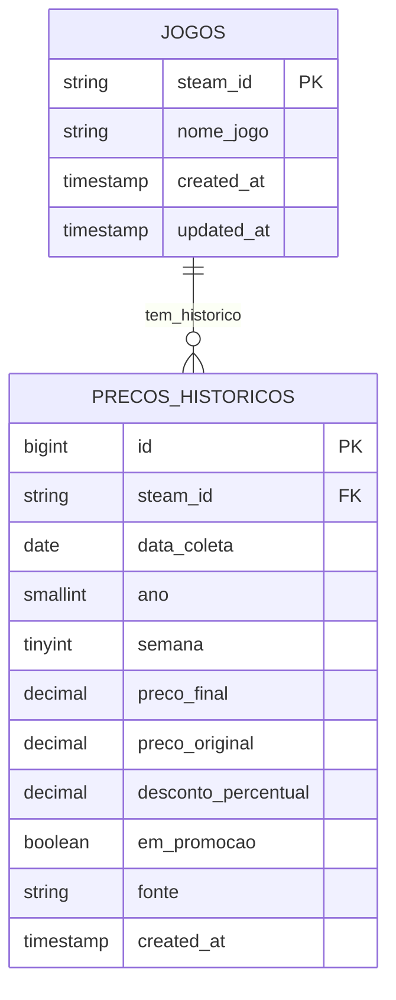

# 🔄 REFATORAÇÃO PARA ESTRUTURA NORMALIZADA

## ❌ ESTRUTURA ATUAL (WIDE FORMAT) - PROBLEMÁTICA
```sql
JOGOS_PRECOS_WIDE {
    nome_jogo VARCHAR(255) PK
    steam_id VARCHAR(20)
    semana_2014-47 DECIMAL(10,2)  -- +400 colunas!
    semana_2014-48 DECIMAL(10,2)
    ...
    semana_2025-34 DECIMAL(10,2)
}
```

## ✅ NOVA ESTRUTURA (LONG FORMAT) - IDEAL

### 1. JOGOS (Tabela Mestre)
```sql
CREATE TABLE jogos (
    steam_id VARCHAR(20) PRIMARY KEY,
    nome_jogo VARCHAR(255) NOT NULL,
    created_at TIMESTAMP DEFAULT NOW(),
    updated_at TIMESTAMP DEFAULT NOW(),
    
    INDEX idx_nome_jogo (nome_jogo)
);
```

### 2. PRECOS_HISTORICOS (Dados Temporais)
```sql
CREATE TABLE precos_historicos (
    id BIGINT PRIMARY KEY AUTO_INCREMENT,
    steam_id VARCHAR(20) NOT NULL,
    data_coleta DATE NOT NULL,
    ano SMALLINT NOT NULL,
    semana TINYINT NOT NULL,
    preco_final DECIMAL(10,2) NOT NULL,
    preco_original DECIMAL(10,2),
    desconto_percentual DECIMAL(5,2) DEFAULT 0,
    em_promocao BOOLEAN DEFAULT FALSE,
    fonte VARCHAR(50) DEFAULT 'SteamDB',
    created_at TIMESTAMP DEFAULT NOW(),
    
    FOREIGN KEY (steam_id) REFERENCES jogos(steam_id),
    
    -- Índices para performance
    PRIMARY KEY (id),
    UNIQUE KEY uk_steam_data (steam_id, data_coleta),
    INDEX idx_steam_id (steam_id),
    INDEX idx_data_coleta (data_coleta),
    INDEX idx_ano_semana (ano, semana),
    INDEX idx_promocao (em_promocao, desconto_percentual),
    
    -- Particionamento por ano para performance
    PARTITION BY RANGE (ano) (
        PARTITION p2020 VALUES LESS THAN (2021),
        PARTITION p2021 VALUES LESS THAN (2022),
        PARTITION p2022 VALUES LESS THAN (2023),
        PARTITION p2023 VALUES LESS THAN (2024),
        PARTITION p2024 VALUES LESS THAN (2025),
        PARTITION p2025 VALUES LESS THAN (2026),
        PARTITION p_future VALUES LESS THAN MAXVALUE
    )
);
```

---

## 🚀 VANTAGENS DA NOVA ESTRUTURA:

### 1. **Facilidade de Consulta:**
```sql
-- Preço atual (última semana):
SELECT p.preco_final 
FROM precos_historicos p 
WHERE p.steam_id = '1245620' 
ORDER BY p.data_coleta DESC 
LIMIT 1;

-- Tendência dos últimos 3 meses:
SELECT data_coleta, preco_final
FROM precos_historicos 
WHERE steam_id = '1245620' 
AND data_coleta >= DATE_SUB(NOW(), INTERVAL 3 MONTH)
ORDER BY data_coleta;

-- Menor preço histórico:
SELECT MIN(preco_final) as menor_preco
FROM precos_historicos 
WHERE steam_id = '1245620';
```

### 2. **Agregações Simples:**
```sql
-- Preço médio por mês:
SELECT 
    YEAR(data_coleta) as ano,
    MONTH(data_coleta) as mes,
    AVG(preco_final) as preco_medio,
    MIN(preco_final) as preco_minimo,
    MAX(preco_final) as preco_maximo
FROM precos_historicos 
WHERE steam_id = '1245620'
GROUP BY ano, mes
ORDER BY ano, mes;
```

### 3. **Inserção Simples:**
```sql
-- Adicionar novo preço (uma linha apenas!):
INSERT INTO precos_historicos 
(steam_id, data_coleta, ano, semana, preco_final, desconto_percentual, em_promocao)
VALUES 
('1245620', '2025-08-27', 2025, 35, 199.90, 33.5, TRUE);
```

---

## 📊 COMPARAÇÃO DE PERFORMANCE:

### Wide Format (Atual):
- ❌ **Schema Changes**: A cada semana
- ❌ **Storage**: 90% desperdício (NULLs)
- ❌ **Queries**: Complexas e lentas
- ❌ **Maintenance**: Pesadelo

### Long Format (Proposto):
- ✅ **Schema Stable**: Nunca muda
- ✅ **Storage**: Otimizado (só dados reais)
- ✅ **Queries**: Simples e rápidas
- ✅ **Maintenance**: Trivial

---

## 🔧 SCRIPT DE MIGRAÇÃO:

```sql
-- 1. Criar novas tabelas
CREATE TABLE jogos (...);
CREATE TABLE precos_historicos (...);

-- 2. Migrar dados existentes
INSERT INTO jogos (steam_id, nome_jogo)
SELECT DISTINCT steam_id, nome_jogo 
FROM JOGOS_PRECOS_WIDE;

-- 3. Transformar wide para long (exemplo para Python):
/*
import pandas as pd

# Ler tabela wide
df_wide = pd.read_csv('steamdb_dataset_geral_wide.csv')

# Transformar para long
df_long = pd.melt(
    df_wide, 
    id_vars=['nome_jogo', 'steam_id'],
    var_name='semana_coluna', 
    value_name='preco_final'
).dropna()

# Extrair ano e semana
df_long['ano'] = df_long['semana_coluna'].str.extract(r'semana_(\d{4})')
df_long['semana'] = df_long['semana_coluna'].str.extract(r'-(\d{2})$')

# Criar data aproximada
df_long['data_coleta'] = pd.to_datetime(
    df_long['ano'] + '-01-01'
) + pd.to_timedelta(df_long['semana'].astype(int) * 7, unit='D')

# Salvar para importação
df_long[['steam_id', 'data_coleta', 'ano', 'semana', 'preco_final']].to_csv(
    'precos_historicos_migração.csv', index=False
)
*/

-- 4. Importar dados transformados
LOAD DATA INFILE 'precos_historicos_migração.csv'
INTO TABLE precos_historicos
FIELDS TERMINATED BY ','
LINES TERMINATED BY '\n'
IGNORE 1 ROWS;

-- 5. Após validação, drop da tabela antiga
-- DROP TABLE JOGOS_PRECOS_WIDE;
```

---

## 🎯 ESTRUTURA FINAL RECOMENDADA:



Essa estrutura resolve **todos** os problemas atuais e é **infinitamente escalável**!
